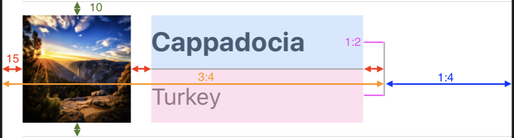

# Overview

This skeleton project serves as a starting point for your interview.

Fork the repository, commit your changes and submit/email a link to the repository containing the completed project.

The project contains some basic classes and storyboard files to help you jump-start and give you a bit of direction.

You can use any third party library or library manager you'd like.

# Instructions

## Basics
Populate the tableView in `ViewController.swift` with the content fetched from the REST API described below.
Looking at `Main.storyboard` and `Cell.swift` should give you a good idea where to start.
The `+` button in the top right corner should trigger posting a new landscape (use hardcoded values - no dialogs required).

_Note: Posting a new landscape will not add it to the landscapes, it serves only as a demonstration._

## REST API interface
Create a REST API interface for the following requests:
 - fetch all landscapes - `GET - http://jsonstub.com/landscapes`
 - post new landscape - `POST - http://jsonstub.com/landscapes`

Usage example:
```
$ curl -X GET http://jsonstub.com/landscapes
    -H "Content-Type: application/json"
    -H "JsonStub-User-Key: 3e312d42-f253-42ff-85f7-7711aae4b633"
    -H "JsonStub-Project-Key: b1aed14b-1256-4e19-ae80-72f735e9362a"
```
_Note: You have to use the headers defined in the example above._

## Persistence
After the initial fetching, persist all the required data to allow the app to work without an internet connection.

_Note: You can either cache the entire JSON file or your custom objects (NSCoder, CoreData, third party DB)._

## Scrolling performance
Loading large images negatively impacts scrolling performance. Address the issue to improve scrolling performance.

## User interface layout
Use auto layout to create scalable cells following spacings and ratios below:


The cell's height should adapt based on the device type:
- 4" iPhone - 80px height


- larger iPhones - 100px height


- iPads - 150px height


_Note: You can either use storyboards, code defined constraints or a third party library._

